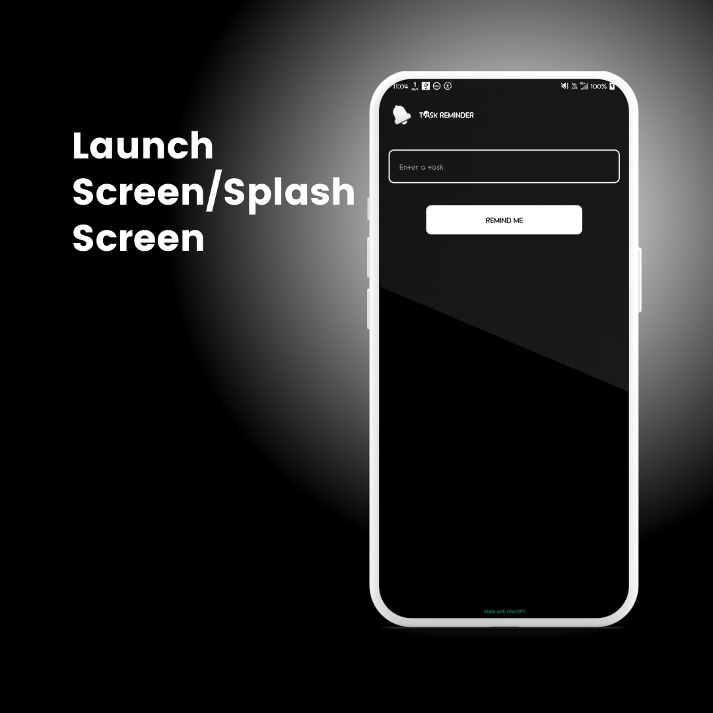
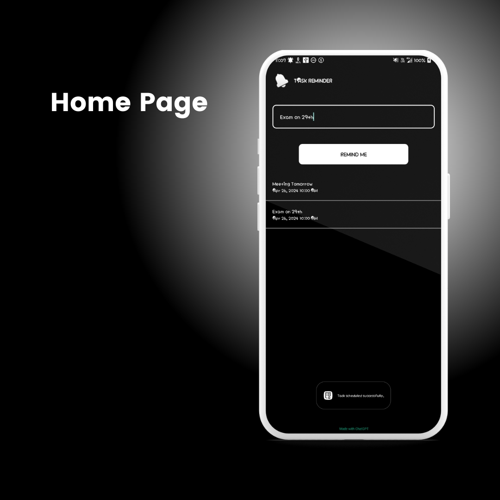
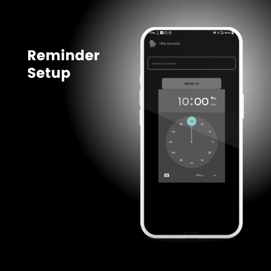
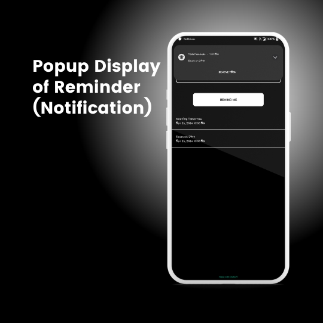

# Task-Minder Application

A task reminder application is a software tool designed to help individuals or teams organize and manage their tasks, appointments, deadlines, and other commitments.

## Table of Contents

- [Introduction](#introduction)
- [Launch Screen/Splash Screen](#launch-screensplash-screen)
- [Home Page](#home-page)
- [Reminder Setup](#reminder-setup)
- [Popup Display of Reminder (Notification)](#popup-display-of-reminder-notification)

## Introduction

This user-friendly application serves as your assistant, ensuring you never miss important tasks or events again. With a simple and intuitive interface, you can easily set reminders for appointments, meetings, birthdays, and more.

Key features include multiple reminder options. The app's calendar integration ensures seamless coordination with your existing schedule. Additionally, you can prioritize reminders and categorize them for better organization. Whether you are a student, professional, or anyone with a busy lifestyle, our basic reminder app will enhance your productivity and time management.

Task-Minder is a straightforward and user-friendly reminder app designed to help you effortlessly organize and keep track of your daily tasks. In today's fast-paced world, it's easy to forget important appointments, deadlines, or everyday chores. Task-Minder aims to simplify your life by providing a reliable tool that ensures you never miss a beat. With Task-Minder, you can easily create tasks with due dates and descriptions. The app sends notifications, keeping you informed and proactive with the task. It also allows you to set up recurring tasks for routine activities, ensuring nothing slips through the cracks. The app's intuitive interface makes it easy for anyone to get started, and its syncing capabilities across devices ensure you have access to your to-do list wherever you go. Task-Minder is the ideal solution for efficient task management.

## Launch Screen/Splash Screen

The app opening page will contain a Task Reminder page which will allow you to enter the popup display message or reminder message. On clicking Remind Me button the next interface will open and the remainder will be set to the same name given as the task name.

## Home Page

The home page of the basic Android reminder app provides a user-friendly interface for managing tasks and appointments efficiently. It typically features a clean layout with options to create and delete reminders. Users can set dates, times, and custom notifications for their tasks. The home page may also display a list of upcoming reminders, ensuring users stay organized and never miss important events. With its intuitive design and functionality, the home page serves as the central hub for users to stay on top of their daily schedules effortlessly.

## Reminder Setup

A reminder will be set at the date and time given in the previous interface and a message will pop up that the task is scheduled successfully to confirm it. We can easily add more tasks or reminders from the same page or delete a task by long-pressing the task added.

## Popup Display of Reminder (Notification)

The app includes popup notifications for reminders, ensuring users never overlook important tasks or appointments. When a reminder is due, a notification popup appears on the device screen, displaying relevant details such as the task name, time, and date. Users can quickly take action on the reminder or dismiss it directly from the popup for added convenience.
